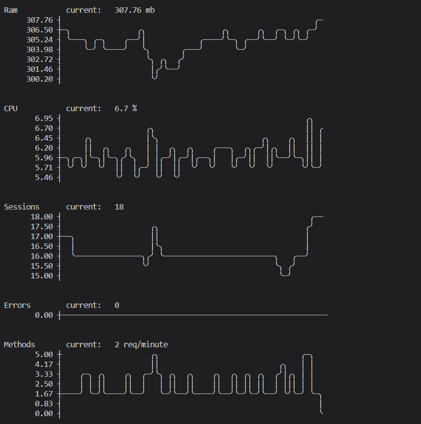

# Monti CLI Example

A node.js cli tool that shows the app's metrics for the last hour.



To set it up, clone the repository and install the dependencies. [Node.js 8](https://nodejs.org/) or newer is required.

```shell
git clone 
cd cli
npm install
```

Next, get your app's id and secret from [app.montiapm.com](https://app.montipam.com).
You can find it in the Settings page for your app.

Now you you can run the cli:

```bash
node ./index.js --appId=<app id> --secret=<secret>
```

It will show your app's metrics for the past hour. Feel free to modify this example
or build on top of it to create your own tools. We would love to [hear about](mailto:hello@montiapm.com) what you build.
