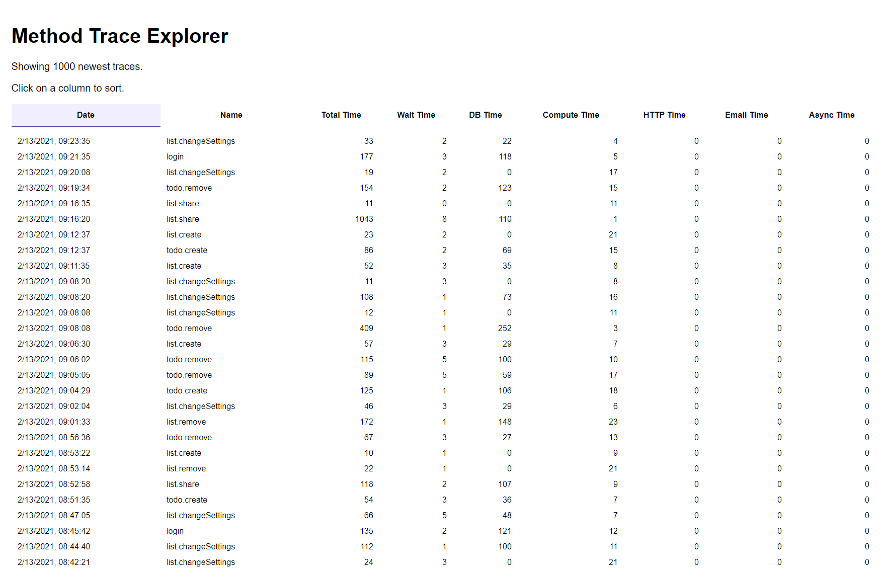

# Monti APM API examples

This repository has example apps or tools using Monti APM's api. Learn more about the api in [our docs](https://docs.montiapm.com/graphql-api).

The examples are:

### [CLI](./cli) - view your app's metrics in the terminal

### [Trace Explorer](./trace-explorer) - view your app's traces

