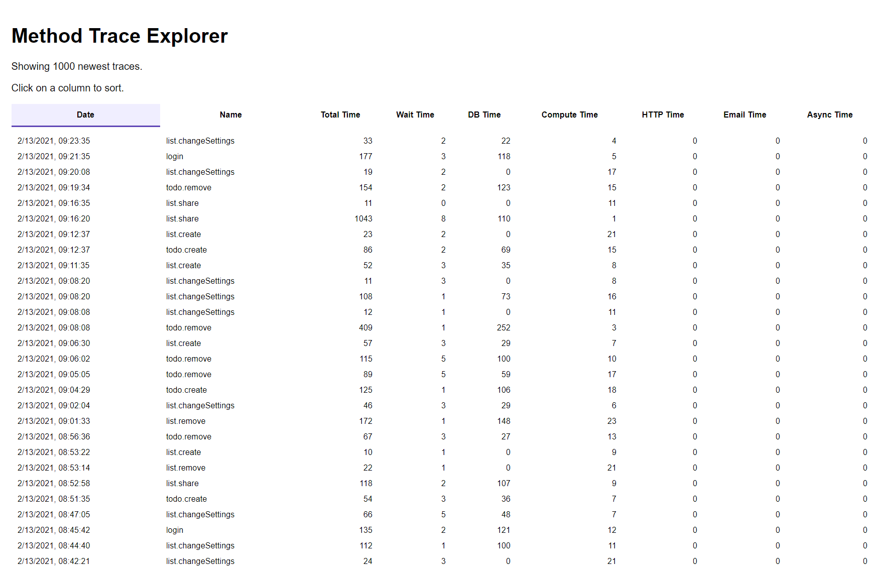

# Monti Trace Explorer Example

A Meteor app that that shows a list of the app's newest traces for Meteor methods, and the events that were recorded in each trace.



To set it up, clone the repository and install the dependencies. [Meteor](https://www.meteor.com/) should be installed first.

```shell
git clone 
cd trace-explorer
meteor npm install
```

Next, get your app's id and secret from [app.montiapm.com](https://app.montipam.com).
You can find it in the Settings page for your app. Then update the `settings.json` file with your app's id and secret.

Now you you start the app:

```bash
meteor npm start
```

Open the app in your browser and explore your app's traces. Feel free to modify this example
or build on top of it to create your own tools. We would love to [hear about](mailto:hello@montiapm.com) what you build.
